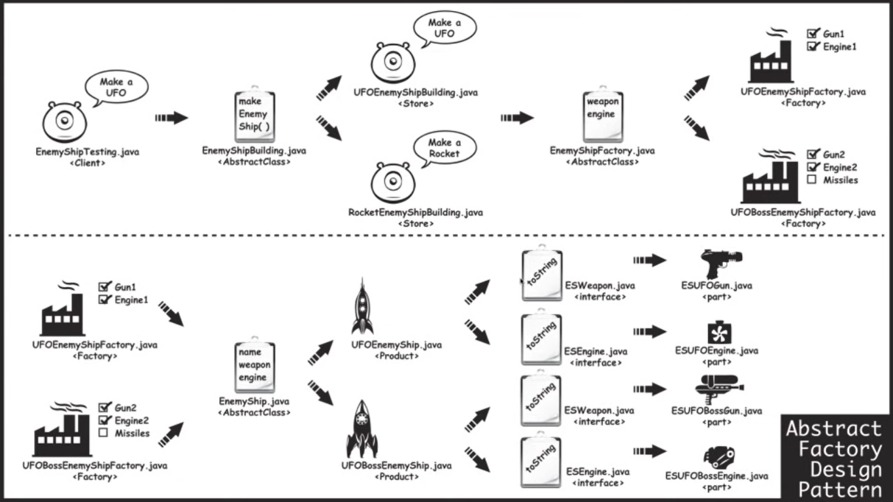

abstract factory design pattern is a creational design pattern.
it is like a factory but everything is encapsulated.
    the method that orders the object
    the factories that build the object
    the final objects
    final objects contains the objects taht use the strategy pattern.(composition - object class fields are objects itself)

here i am building the same enemyship factory as in factory pattern including untill make guns as abstract classes.

