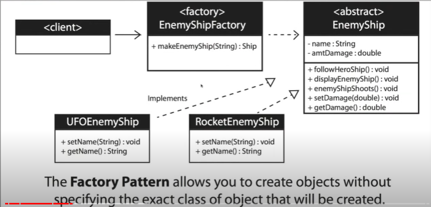

this pattern is included in creational design patterns
The class is choosen at runtime

When to use 
when you don't know ahead of time what class object you need
when all of the potantial classes are in the same subclass hierarchy
to centralize class selection code
when you don't want the user to have to know every sub class
to encapsulate object creation

Here i am building a factory that gives a required type of enemy ship dynamically.

